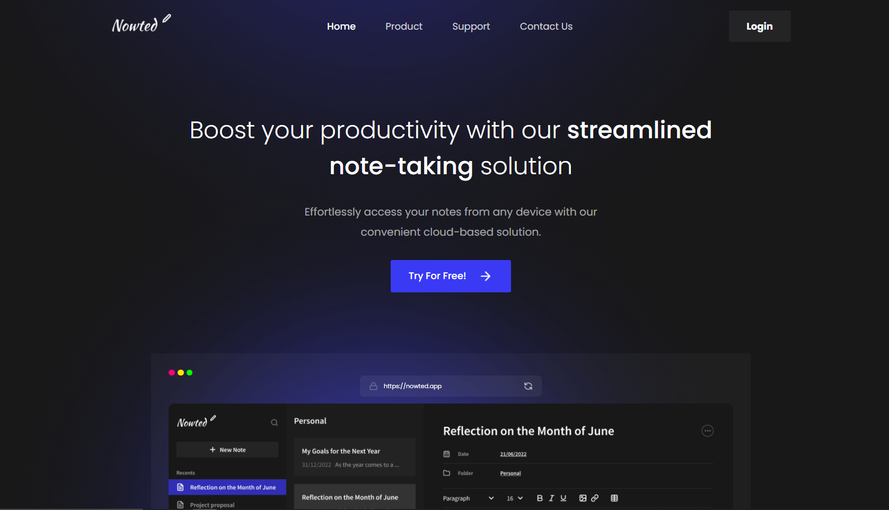

# Slicing Website - Nowted

This repository contains the code for the "Nowted" website, which is the result of slicing the design obtained from [CodeDesign.dev](https://codedesign.dev/). This website is built using modern web technologies such as HTML, CSS.

## Description

The Nowted Hero component is a visually striking and highly functional element of a note-taking app website. It features a clean and modern design, with a centered headline, subheadline, and a single call-to-action button inviting users to try the product. 
